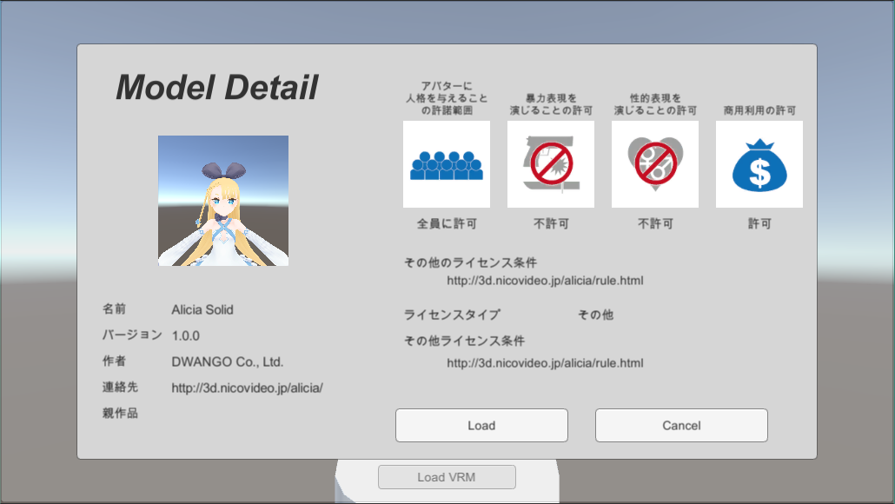
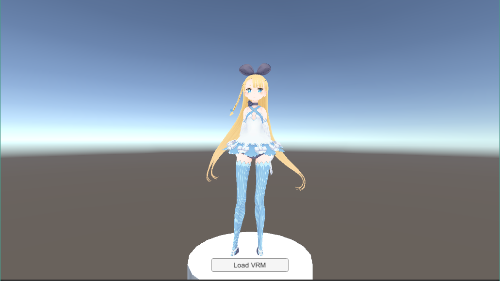

# VRMLoaderUI
VRM Loader UI

## What is this?

VRMをロードする時のUIアセットです

## Download

[Release Page](https://github.com/m2wasabi/VRMLoaderUI/releases) からunitypackageをダウンロードしてください。

## Usage

基本的な呼び出し方は以下です。

```csharp
    // UIを表示させるcanvasを指定します
    [SerializeField]
    Canvas m_canvas;

    // VRMLoaderUI/Prefabs/LoadConfirmModal を指定します
    [SerializeField]
    GameObject m_modalWindowPrefab;


    byte[] bytes = File.ReadAllBytes(path);

    var context = new VRMImporterContext();
    context.ParseGlb(bytes);
    var meta = context.ReadMeta(true);

    // ファイル読み込みモーダルウィンドウの呼び出し
    GameObject modalObject = Instantiate(m_modalWindowPrefab, m_canvas.transform) as GameObject;

    // 言語設定を取得・反映する
    var modalLocale = modalObject.GetComponentInChildren<VRMPreviewLocale>();
    modalLocale.SetLocale(m_language.captionText.text);

    // meta情報の反映
    var modalUI = modalObject.GetComponentInChildren<VRMPreviewUI>();
    modalUI.setMeta(meta);

    // ファイルを開くことの許可
    // ToDo: ファイルの読み込み許可を制御する場合はここで
    modalUI.setLoadable(true);

    // ロードイベントの追加
    modalUI.m_ok.onClick.AddListener(ModelLoad);
```

詳しい使い方はExampleを参照してください。

### Exampleの説明

画面中央下部のボタンをクリックするとVRMをロードする。





#### ExampleLoaderLegacy

Unity 5.6.3.p1 のUniRx無しで動くサンプル

必要ライブラリ

+ [UniVRM](https://github.com/dwango/UniVRM/releases)

#### ExampleLoader

Unity2018.1 .NET4.6 のUniRx使用で動くサンプル

必要ライブラリ

+ [UniVRM](https://github.com/dwango/UniVRM/releases)
+ [UniRx](https://github.com/neuecc/UniRx/releases)

### 国際化対応

デフォルトでは 日本語(ja) と 英語(en) のみ実装しています。  
言語を追加したい場合は次のフォルダの内容をコピーして拡張して下さい。`/Assets/StreamingAssets/VRMLoaderUI/i18n/*.json`

### デザインのカスタマイズ

ウィンドウの背景や文字色など、心理的にカスタマイズしやすいように、デフォルトUIになっています。
自由に調整して自分アプリに合ったUIにしましょう。

アイコンの[アートワーク](Images/VRM_permissions.ai)もIllustrator形式で添付しているので、自由に変更して頂いて構いません。

## ライセンス

ソースコード: MITライセンス  
アートワーク: CC0  
